# retry-wire

**Provider-aware retry and throttle for LLM API calls — a tiny, zero-dependency wrapper around `fetch` or any async call that understands the 429s, 529 overloads, and `Retry-After` headers that generic retry libraries ignore. For Node, the browser, and Bun.**

<p>
  <a href="https://www.npmjs.com/package/retry-wire"></a>
  <a href="https://github.com/H1manshu01/retry-wire/actions/workflows/ci.yml"></a>
  <a href="https://bundlephobia.com/package/retry-wire"></a>
  
  <a href="./LICENSE"></a>
</p>



An LLM endpoint fails differently from a generic HTTP service. It hands you a **429** that may be a quota limit or a momentary burst; Anthropic adds a **529 `overloaded_error`** that means "saturated, try again" — a different thing from a quota 429. It tells you exactly how long to wait in a `Retry-After` (seconds or an HTTP date) or a `retry-after-ms` header, and it reports your remaining budget in `x-ratelimit-*` / `anthropic-ratelimit-*` headers. Generic retry libraries model none of this: they treat every failure the same, ignore the server's advised wait, and retry blindly into a limit you could have paced under.

The official SDKs *do* know these rules — but the retry logic is **welded to their client**. The moment you use a gateway, a proxy, your own `fetch`, or a streaming client like [`sse-wire`](https://www.npmjs.com/package/sse-wire), you lose it.

`retry-wire` is that logic, unbundled: a provider-aware retry policy you can wrap around **any** `fetch` or **any** async call.

```ts
import { retryFetch, withResilience } from "retry-wire";

// 1. A drop-in fetch wrapper — composes with any client, including sse-wire
const rfetch = retryFetch(fetch, { provider: "openai", maxRetries: 5 });
const res = await rfetch("https://api.openai.com/v1/chat/completions", {
  method: "POST",
  body,
  signal,
});

// 2. Wrap any async call — an SDK method, a custom client
const out = await withResilience(
  (signal) => client.messages.create(params, { signal }),
  { provider: "anthropic", maxRetries: 5 }, // handles 529 overloaded distinctly
);
```

Both carry the same provider knowledge; they differ only in what they wrap — a `fetch`, or an arbitrary promise.

## Why another one?

Retry is well-trodden ground. But an **LLM call** specifically needs: retries keyed to provider rate-limit semantics (429 vs. Anthropic's 529, plus 408/409/5xx and network errors), honoring the server's `Retry-After` / `retry-after-ms` **over** a blind backoff curve, optional client-side pacing to stay *under* a tier's RPM/TPM limits instead of only reacting to a 429, an `AbortSignal` that cancels a pending backoff wait, and a policy that is **not** chained to one client. Most libraries solve generic retry; the gaps are exactly where LLM traffic lives.

| | retry-wire | `p-retry` | `cockatiel` | `ky` retry | openai-node / `@anthropic-ai/sdk` built-in |
|---|:---:|:---:|:---:|:---:|:---:|
| Provider rate-limit rules (429 / 529 / 5xx) | Yes | By hand | By hand | Partial | Yes (own client only) |
| Honors `Retry-After` / `retry-after-ms` | Yes | — | — | Partial | Yes |
| 529 `overloaded_error` distinct from a quota 429 | Yes | — | — | — | Varies |
| Transport-agnostic (any `fetch` **and** any async call) | Yes | Any promise | Any promise | `ky` only | — (welded to client) |
| Token-aware client-side pacing (RPM / TPM) | Yes | — | Rate-limit policy, not token-aware | — | — |
| `AbortSignal` cancels a pending backoff wait | Yes | Partial | Yes | Partial | n/a |
| Deterministic (injectable clock / sleep) | Yes | — | — | — | — |
| Zero runtime dependencies | Yes | Small deps | Yes | — (ships in `ky`) | n/a |

Comparison claims about third-party libraries are **as of early 2026** — re-check each project before quoting it. See [COMPETITORS.md](./COMPETITORS.md) for the full scan with specifics.

## Composes with sse-wire

The two are complementary, not overlapping. [`sse-wire`](https://www.npmjs.com/package/sse-wire) reconnects a *stream* that drops mid-answer; `retry-wire` resilience-wraps the *request that opens the stream*, so a 429 or 529 on the way in is retried before a single byte streams:

```ts
import { retryFetch } from "retry-wire";
import { sse } from "sse-wire";

// retry-wire owns the retry policy for opening the connection;
// sse-wire owns reading and (optionally) reconnecting the stream.
const rfetch = retryFetch(fetch, { provider: "openai", maxRetries: 5 });

for await (const event of sse("https://api.openai.com/v1/chat/completions", {
  method: "POST",
  headers: { authorization: `Bearer ${key}`, "content-type": "application/json" },
  body: JSON.stringify({ model, stream: true, messages }),
  fetch: rfetch, // sse-wire opens the stream through the resilient fetch
})) {
  if (event.data === "[DONE]") break;
  render(JSON.parse(event.data));
}
```

`retry-wire` is part of the author's LLM dev-tools line — siblings:
[`sse-wire`](https://www.npmjs.com/package/sse-wire) (fetch-based SSE),
[`trickle-json`](https://www.npmjs.com/package/trickle-json) (streaming partial-JSON parse),
[`coerce-json`](https://www.npmjs.com/package/coerce-json) (schema repair/coercion),
[`trickle-react`](https://www.npmjs.com/package/trickle-react) (React bindings),
[`expect-llm`](https://www.npmjs.com/package/expect-llm) (LLM output assertions),
[`context-budgeter`](https://www.npmjs.com/package/context-budgeter) (fit a history into the context window), and
[`trickle-structured`](https://www.npmjs.com/package/trickle-structured) (the capstone: one call from `fetch` to a validated object).
Each is zero-dependency and useful on its own.

## Install

```sh
npm install retry-wire
```

Zero runtime dependencies. Ships ESM + CJS + `.d.ts`, ~1.68 kB min+brotli. Runs anywhere there's a global `fetch` and `AbortController`: **Node ≥ 18**, modern **browsers**, and **Bun**. On older runtimes without a global `fetch`, pass one into `retryFetch`.

## API

Single entry point, no subpaths.

```ts
import {
  withResilience,
  retryFetch,
  computeBackoff,
  openaiPack,
  anthropicPack,
  genericPack,
  defineRulePack,
  resolvePack,
  parseRetryAfter,
  Throttle,
} from "retry-wire";
import type {
  ResilienceOptions,
  RulePack,
  RetryContext,
  RateLimitInfo,
  BackoffOptions,
  ThrottleOptions,
  RetryInfo,
  Provider,
} from "retry-wire";
```

### `retryFetch(fetch?, options?) → typeof fetch`

A drop-in `fetch` wrapper. Returns a function with the exact `fetch` signature, so it slots in anywhere a `fetch` is accepted — a client option, `sse-wire`'s `fetch` option, or a global shim.

```ts
const rfetch = retryFetch(fetch, { provider: "openai", maxRetries: 5 });
const res = await rfetch(url, { method: "POST", body, signal });
```

- `fetch` defaults to `globalThis.fetch`; pass your own for older runtimes, tests, or instrumentation.
- Retries on **retryable responses** — 429, 529, 5xx, and 408/409 — per the provider's [rule pack](#provider-rule-packs), and on **network errors** (a thrown `TypeError` from `fetch`).
- Honors `Retry-After` / `retry-after-ms` on the response, in preference to the backoff curve (`respectRetryAfter`, default `true`).
- **Drains the response body** (`response.body.cancel()`) before sleeping and retrying, so a retried connection is released rather than leaked.
- Reads `signal` from the per-call `init.signal` first, then the `options.signal`; an abort rejects the call and cancels any pending backoff wait.
- A non-retryable response (e.g. 200, 400) is returned **as-is** — `retryFetch` never throws on an HTTP status, exactly like `fetch`.

### `withResilience<T>(op, options?) → Promise<T>`

Wraps **any** async operation — an SDK method, a database call, a custom client. It retries on **thrown** errors (SDK errors, network failures), reading the status and headers off the thrown object.

```ts
const out = await withResilience(
  (signal) => client.messages.create(params, { signal }),
  {
    provider: "anthropic",
    maxRetries: 5,
    backoff: { initial: 500, max: 60_000, jitter: "full" },
    onRetry: ({ attempt, delayMs, reason }) =>
      console.warn(`retry ${attempt} in ${delayMs}ms: ${reason}`),
  },
);
```

- `op` receives an `AbortSignal` (when you pass `options.signal`) to forward to the underlying call, so an abort cancels the in-flight request too.
- It reads the thrown error's `status` / `statusCode` / `response.status` and `headers` / `response.headers` to build the retry decision — matching how the `openai` and `@anthropic-ai/sdk` error objects are shaped.
- An `AbortError` (or an already-aborted `signal`) is **never** retried; it propagates immediately.
- A non-retryable error (e.g. a 400, or any error when `idempotent` is `false`) is re-thrown unchanged.

### `computeBackoff(attempt, backoff) → number`

The backoff curve, exported for inspection or reuse. `attempt` is 0-based; `backoff` is a fully-resolved `Required<BackoffOptions>`.

```ts
computeBackoff(0, { initial: 500, max: 60_000, factor: 2, jitter: "none" }); // 500
computeBackoff(1, { initial: 500, max: 60_000, factor: 2, jitter: "none" }); // 1000
computeBackoff(2, { initial: 500, max: 60_000, factor: 2, jitter: "none" }); // 2000
```

The base delay is `min(initial * factor ** attempt, max)`. Then jitter is applied: `"none"` returns the base, `"equal"` returns `base/2 + random(0, base/2)`, and `"full"` (the default) returns `random(0, base)`. Jitter spreads retries so a fleet of clients doesn't stampede the endpoint in lockstep.

## Options

Both `retryFetch` and `withResilience` take the same `ResilienceOptions`.

| Option | Type | Default | What it does |
|---|---|---|---|
| `provider` | `"openai" \| "anthropic" \| "generic" \| RulePack` | `"generic"` | Which [rule pack](#provider-rule-packs) decides what's retryable and how to read headers. Pass a custom `RulePack` for a gateway or another provider. |
| `maxRetries` | `number` | `3` | Retries **after** the first attempt. `3` means up to 4 total calls. |
| `backoff` | `{ initial?, max?, factor?, jitter? }` | `{ 500, 60000, 2, "full" }` | Exponential backoff. `initial` (ms) first delay, `max` (ms) ceiling, `factor` the exponent base, `jitter` one of `"full"` / `"equal"` / `"none"`. |
| `respectRetryAfter` | `boolean` | `true` | Honor the server's `Retry-After` / `retry-after-ms` over the backoff curve when present. |
| `idempotent` | `boolean` | `true` | Whether the call is safe to retry. LLM completions have no side effects, so this defaults `true`. Set `false` for calls that mutate server state — they are then **never** retried. |
| `throttle` | `{ rpm?, tpm?, estimateTokens? }` | — | Opt-in client-side pacing to stay under a tier's limits. See [Throttling](#throttling). |
| `signal` | `AbortSignal \| null` | — | Aborts the in-flight call **and** any pending backoff wait. In `retryFetch`, a per-call `init.signal` takes precedence. |
| `onRetry` | `(info: RetryInfo) => void` | — | Called before each retry sleep with `{ attempt, delayMs, reason, status? }`. `attempt` is 1-based; `reason` is `"HTTP <status>"` or `"network error"`. |
| `now` | `() => number` | `Date.now` | Advanced/testing: injectable clock. |
| `sleep` | `(ms, signal?) => Promise<void>` | real abortable timer | Advanced/testing: injectable sleep, so tests run with zero wall-clock delay. |

## Provider rule packs

A **rule pack** is the data that makes retry provider-aware. It is plain data — no hardcoded `if (provider === …)` — so you can swap or author one freely.

```ts
interface RulePack {
  name?: string;
  isRetryable(ctx: RetryContext): boolean;      // is this outcome worth retrying?
  retryAfterMs(headers: Headers): number | undefined; // the server's advised wait
  readLimits?(headers: Headers): RateLimitInfo;  // remaining request/token budget
}
```

Three packs ship built in:

- **`genericPack`** (the default) — retries network errors, `408`, `409`, `429`, and any `5xx`. Reads `retry-after-ms` then `Retry-After` (seconds or an HTTP date).
- **`openaiPack`** — the same retryable set, plus `readLimits` for OpenAI's `x-ratelimit-remaining-requests` / `x-ratelimit-remaining-tokens` and the `x-ratelimit-reset-*` duration headers (`"6m0s"`, `"100ms"`, `"1.5s"`).
- **`anthropicPack`** — additionally treats **`529` `overloaded_error`** as retryable (the service is saturated — distinct from a quota `429`), and reads the `anthropic-ratelimit-*-remaining` / `-reset` headers.

Select one by name, or hand `withResilience` / `retryFetch` a pack object directly:

```ts
import { withResilience, openaiPack } from "retry-wire";

await withResilience(op, { provider: "openai" });   // by name
await withResilience(op, { provider: openaiPack });  // the pack itself
```

### A custom pack

For a gateway, Bedrock, Vertex, Azure, or any endpoint with its own rules, `defineRulePack` is an identity helper that gives you the type checking:

```ts
import { defineRulePack, parseRetryAfter, withResilience } from "retry-wire";

const bedrockPack = defineRulePack({
  name: "bedrock",
  isRetryable: (ctx) =>
    ctx.status === 429 || ctx.status === 503 || (ctx.status === undefined && !!ctx.error),
  retryAfterMs: (headers) => parseRetryAfter(headers), // reuse the built-in parser
});

await withResilience(op, { provider: bedrockPack });
```

`parseRetryAfter(headers, now?)` and `resolvePack(provider?)` are exported too — the former for reusing the header parser, the latter for resolving a name (or a pack, or `undefined`) to a concrete pack.

## Throttling

Retrying *reacts* to a 429. Throttling *avoids* it — pace your own calls under the tier limit before the provider has to. It's opt-in via `throttle`, built on token buckets refilled continuously over a one-minute window.

```ts
import { retryFetch } from "retry-wire";

const rfetch = retryFetch(fetch, {
  provider: "openai",
  throttle: {
    rpm: 50,        // requests per minute
    tpm: 40_000,    // tokens per minute
    estimateTokens: (input, init) => countTokens(init?.body),
  },
});
```

- **`rpm`** paces requests: one bucket token per call. It applies to both `retryFetch` and `withResilience`.
- **`tpm`** paces token spend, charging each call the cost from **`estimateTokens(input, init)`**. Because the cost comes from the request's `input` / `init`, TPM pacing and `estimateTokens` take effect in **`retryFetch`** (which has the request in hand); `withResilience` paces on **`rpm` only**.
- A bucket starts full, refills at `limit / 60000` tokens per ms, and a call that outruns the budget waits — on the injectable `sleep`, so an `AbortSignal` cancels the wait.

The `Throttle` class is also exported if you want to pace outside a retry wrapper:

```ts
import { Throttle } from "retry-wire";

const t = new Throttle({ rpm: 60 }, Date.now());
await t.acquire(1, Date.now, sleep); // resolves when a request token is available
```

> Throttling is **per-process, in-memory**. It paces one Node process (or one browser tab); it is not a distributed limiter shared across machines or workers.

## Guardrails

The point of a retry layer is to be trustworthy under failure. `retry-wire` holds these invariants, covered by 25 unit tests (`test/`):

- **Zero runtime dependencies.** Nothing to audit transitively; ~1.68 kB min+brotli.
- **Non-idempotent calls are never retried.** With `idempotent: false`, a failure propagates on the first attempt — no silent duplicate of a call with side effects. (`idempotent` defaults to `true` because LLM completions are safe to repeat.)
- **Abort cancels a pending backoff wait.** An abort during the sleep **between** attempts rejects immediately with the abort reason rather than sleeping it out, and an already-aborted signal throws before the first call runs.
- **The server's advised wait wins.** When `respectRetryAfter` is on and a `Retry-After` / `retry-after-ms` is present, that delay is used instead of the backoff curve — so you wait exactly as long as the provider asked, no more.
- **Deterministic by construction.** The clock (`now`) and timer (`sleep`) are injectable, so the whole retry/throttle behavior is testable with zero wall-clock delay and no flakiness. The suite drives every timing assertion through a fake clock.
- **Jittered backoff.** `"full"` (default) and `"equal"` jitter spread retries so concurrent clients don't retry in lockstep.
- **`retryFetch` releases bodies.** The response body is cancelled before each retry, so a retried request doesn't leak a connection.

## Types

```ts
type Provider = "openai" | "anthropic" | "generic";

interface ResilienceOptions {
  provider?: Provider | RulePack;        // default "generic"
  maxRetries?: number;                   // default 3
  backoff?: BackoffOptions;
  respectRetryAfter?: boolean;           // default true
  idempotent?: boolean;                  // default true
  throttle?: ThrottleOptions;
  signal?: AbortSignal | null;
  onRetry?: (info: RetryInfo) => void;
  now?: () => number;                    // default Date.now
  sleep?: (ms: number, signal?: AbortSignal | null) => Promise<void>;
}

interface BackoffOptions {
  initial?: number;  // default 500 (ms)
  max?: number;      // default 60000 (ms)
  factor?: number;   // default 2
  jitter?: "full" | "equal" | "none"; // default "full"
}

interface ThrottleOptions {
  rpm?: number;
  tpm?: number;
  estimateTokens?: (input: unknown, init?: unknown) => number;
}

interface RetryInfo {
  attempt: number;   // 1-based
  delayMs: number;
  reason: string;    // "HTTP <status>" or "network error"
  status?: number;
}

interface RetryContext {
  status?: number;   // HTTP status, when there is a response
  error?: unknown;   // the thrown error, when the call rejected
  body?: unknown;    // parsed error body, if available
  headers?: Headers; // response/error headers, if available
}

interface RateLimitInfo {
  requestsRemaining?: number;
  tokensRemaining?: number;
  resetMs?: number;  // ms until the limit resets
}

interface RulePack {
  name?: string;
  isRetryable(ctx: RetryContext): boolean;
  retryAfterMs(headers: Headers): number | undefined;
  readLimits?(headers: Headers): RateLimitInfo;
}
```

## Development

```sh
npm install
npm test          # vitest (25 unit tests)
npm run typecheck
npm run build     # tsup → ESM + CJS + .d.ts
npm run size      # size-limit
npm run lint      # Biome
npm run smoke     # cross-runtime smoke test against built dist/ (Node + Bun)
```

## License

MIT © Himanshu Sharma
